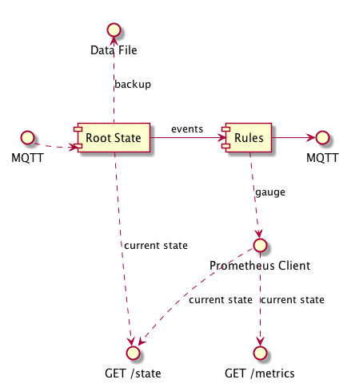

# mqtt-state

State management for home automation (or potentially anything else) based on MQTT input/output.

Allows for transformation of MQTT input events into managed state that is output in realtime as MQTT events, and fetchable at any time using Prometheus or simple JSON via HTTP.

> BREAKING CHANGE IN 2.0 - now uses Accept header rather than always returning JSON. Note you can override the accept header using query string (?accept=application/json). This was primarily to allow Node-RED to continue fetch in JSON.



## Environment

`CONFIG_PATH` - path to configuration file

`CONSUL_KEY` - new in 3.3. Load configuration from Consul at this key path.

If neither specified will default to `config.yml` in the app folder.

## Installing

```
npm i -g mqtt-state
```

## Configuring

First create a config file (see config.example.yml).

Specify the MQTT URI, topics to subscribe to (wildcards allowed), a place to persist state permanently, and a list of rules (see below).

### Importing

To break up large config files you can import rules from extra files:

```yaml
rules:
  - import: "/path/to/rules.yml"
```

## Running

```
CONFIG_PATH=/path/to/config.yml mqtt-state
```

MQTT subscriptions are persisted in the root (Redux) state.

Rules are bound to the Redux state using RxJs and output as MQTT events when their value is updated.

The entire current state (root state, plus calculated rule state) can be fetched at any time by `http://localhost:3000/state`.

Rule state for numeric values is available as Prometheus metrics via `http://localhost:3000/metrics`.

## Rule Types

```
- key: myroom/temperature
  type: alias
  source: root/value/sensor/myroom/temperature
- key: myroom/toocold
  type: calculation
  op: '<'
  source: myroom/temperature
  value: 18
- key: house/temperatures
  type: merge
  sources:
    bedroom: 'myroom/temperature'
    nursery: 'room2/temperature'
- key: myroom/motion
  type: match
  source: 'root/rf433/rfin'
  regexp: '.*(56775C|D58975)$'
- key: myroom/presence
  type: activity
  interval: 60000
  sources:
    - 'myroom/motion'
- key: myroom/should_turn_on_heater
  type: logical
  op: and
  sources:
    - myroom/toocold
    - environment/dark
- key: house/presence
  type: logical
  op: or
  sources:
    - myroom/presence
    - room2/presence
```
