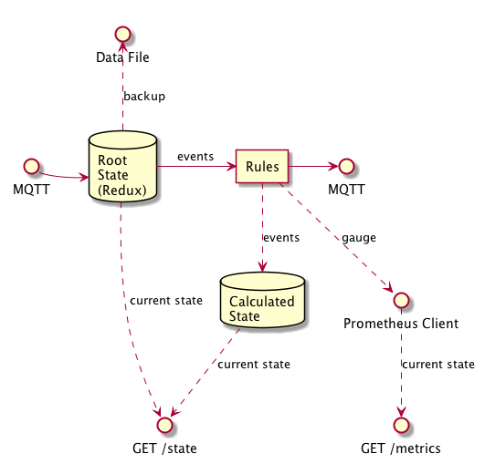

# MQTT State

State management for home automation (or potentially anything else) based on MQTT input/output.

Allows for transformation of MQTT input events into managed state that is output in realtime as MQTT events, and fetchable at any time using Prometheus or simple JSON via HTTP.

